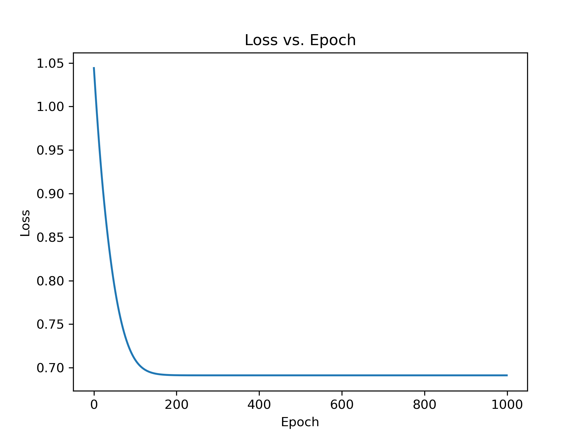
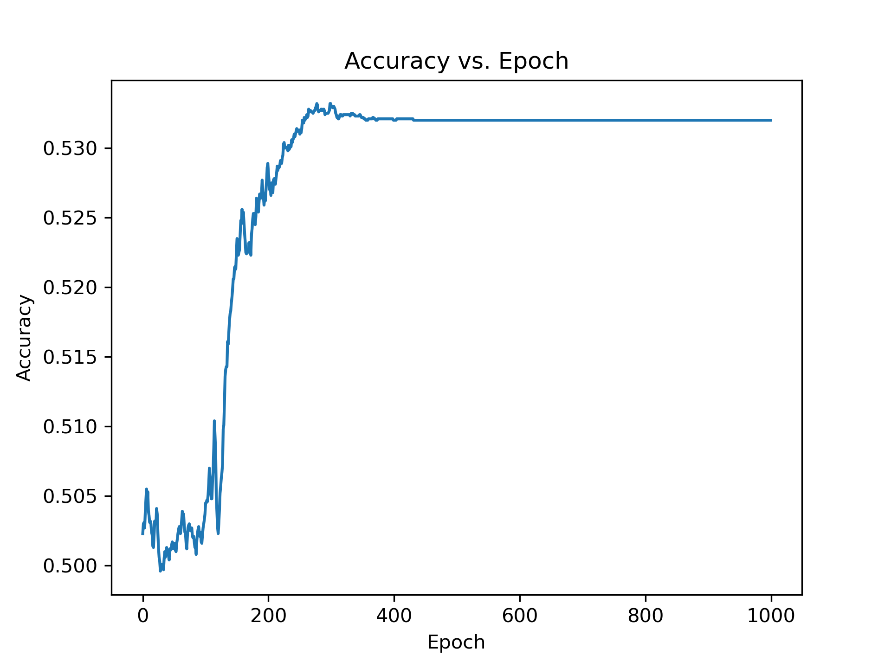

# 线性判别函数上机题

**姓名：** 甘云冲

**学号：** 2101213081

实现部分采用PyTorch作为基本框架，进行矩阵运算相关操作，定义类似于sklearn的Estimater的判别器对数据进行线性判别。

## Fisher线性判别

定义判别器如下：

```python
class FisherLinearDiscriminant(ClassifierEstimator):
    def __init__(self) -> None:
        self.w = None
        self.b = None

    def fit(self, X: torch.Tensor, y: torch.Tensor) -> None:
        X1 = X[y == 1]
        X2 = X[y == 0]
        m1 = X1.mean(dim=0, keepdim=True)
        m2 = X2.mean(dim=0, keepdim=True)
        S1 = (X1 - m1).T @ (X1 - m1)
        S2 = (X2 - m2).T @ (X2 - m2)
        Sw = S1 + S2
        self.w = torch.inverse(Sw) @ (m1 - m2).T
        self.b = -0.5 * (m1 + m2) @ self.w

    def predict(self, X: torch.Tensor) -> torch.Tensor:
        assert self.w is not None and self.b is not None
        y_pred = F.relu(torch.sign(X @ self.w + self.b))
        return y_pred.flatten().long()
```


采用课件当中的推导方法，进行$\mathbf{w}$与$b$的计算，最终得到的分类准确性为$0.5321$。

##  Logistic回归

定义分类器如下：

```python
class LogisticRegression(ClassifierEstimator):
    def __init__(self, in_features: int = 56, lr: float = 0.001,
                 max_epochs: int = 1000, verbose: int = 50) -> None:
        self.lr = lr
        self.max_epochs = max_epochs

        self.model = nn.Linear(in_features, 1)
        self.loss = nn.BCEWithLogitsLoss()
        self.optimizer = Adam(self.model.parameters(), lr=self.lr)
        self.verbose = verbose

        self.history = []

    def fit(self, X: torch.Tensor, y: torch.Tensor) -> None:
        y = y.float()
        for epoch in range(1, self.max_epochs+1):
            y_pred = self.model(X).flatten()
            loss = self.loss(y_pred, y)
            loss.backward()
            self.optimizer.step()
            self.optimizer.zero_grad()
            accuracy = self.score(X, y)
            self.history.append(
                {
                    "epoch": epoch,
                    "loss": loss.item(),
                    "accuracy": accuracy,
                }
            )
            if epoch % self.verbose == 0:
                print(
                    f"Epoch {epoch}/{self.max_epochs} - Loss: {loss.item():.4f} - Accuracy: {accuracy:.4f}"
                )

    def predict(self, X: torch.Tensor) -> torch.Tensor:
        y_pred = F.relu(torch.sign(self.model(X)))
        return y_pred.flatten().long()
```

利用Adam优化器进行梯度下降的优化，训练过程如下所示：

```
Epoch 50/1000 - Loss: 0.9044 - Accuracy: 0.4983
Epoch 100/1000 - Loss: 0.7356 - Accuracy: 0.5022
Epoch 150/1000 - Loss: 0.6948 - Accuracy: 0.5182
Epoch 200/1000 - Loss: 0.6914 - Accuracy: 0.5242
Epoch 250/1000 - Loss: 0.6912 - Accuracy: 0.5304
Epoch 300/1000 - Loss: 0.6912 - Accuracy: 0.5323
Epoch 350/1000 - Loss: 0.6912 - Accuracy: 0.5322
Epoch 400/1000 - Loss: 0.6912 - Accuracy: 0.5320
Epoch 450/1000 - Loss: 0.6912 - Accuracy: 0.5320
Epoch 500/1000 - Loss: 0.6912 - Accuracy: 0.5320
Epoch 550/1000 - Loss: 0.6912 - Accuracy: 0.5320
Epoch 600/1000 - Loss: 0.6912 - Accuracy: 0.5320
Epoch 650/1000 - Loss: 0.6912 - Accuracy: 0.5320
Epoch 700/1000 - Loss: 0.6912 - Accuracy: 0.5320
Epoch 750/1000 - Loss: 0.6912 - Accuracy: 0.5320
Epoch 800/1000 - Loss: 0.6912 - Accuracy: 0.5320
Epoch 850/1000 - Loss: 0.6912 - Accuracy: 0.5320
Epoch 900/1000 - Loss: 0.6912 - Accuracy: 0.5320
Epoch 950/1000 - Loss: 0.6912 - Accuracy: 0.5320
Epoch 1000/1000 - Loss: 0.6912 - Accuracy: 0.5320
```

对应的Loss曲线：



对应的Accuracy曲线：



可以发现，在大约两百次迭代左右，Logistic回归模型收敛到一个稳定状态。

## 结论与分析

* 数据集并非一个接近线性可分的状态，两种线性判别方法都只能获得略高于50%的结果。
* 面对着这样的一个数据集，LR和Fisher线性判别这样的线性判别方法有着相似的效果。

