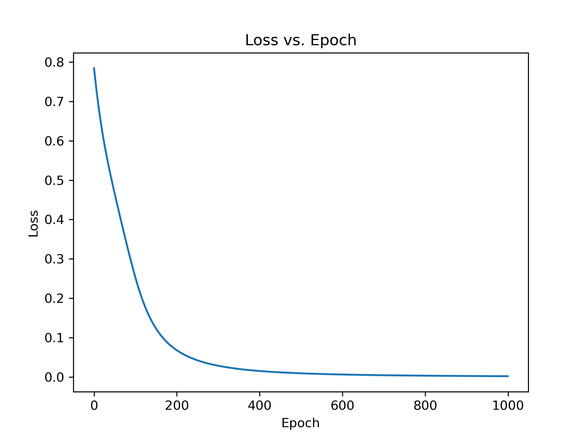
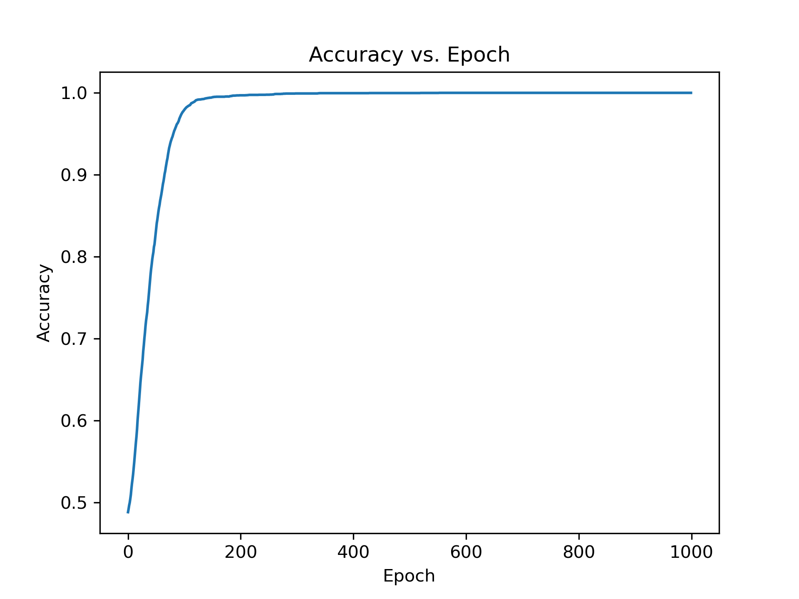

# 非线性判别方法上机题

**姓名：** 甘云冲

**学号：** 2101213081

实现部分采用PyTorch作为基本框架，进行矩阵运算相关操作，定义类似于sklearn的Estimater的判别器对数据进行非线性判别。其中核Fisher方法与神经网络为自己实现，SVM直接采用sklearn当中的实现方法。

这里采用80%的数据作为训练集，20%的数据作为测试集。设置随机种子为42保证实验可复现性，并且所有模型都采用同样的训练集和测试集。

关于超参数设置，多层感知机采用一层16个单元的隐藏，ReLU作为激活函数，使用Adam优化器以0.001的学习率进行1000个Epoch的迭代。RBF核设置gamma=1，多项式核设置degree=3。对应的实验结果如下表所示：

| Model          | Kernel     | Accuracy-Train | Accuracy-Test |
| -------------- | ---------- | -------------- | ------------- |
| Neural Network | -          | 1.000          | 1.000         |
| SVM            | Linear     | 0.505          | 0.488         |
| SVM            | RBF        | 1.000          | 0.744         |
| SVM            | Polynomial | Not Converged  | Not Converged |
| Kernel Fisher  | Linear     | 0.528          | 0.496         |
| Kernel Fisher  | RBF        | 1.000          | 0.791         |
| Kernel Fisher  | Polynomial | 0.710          | 0.656         |

多层感知机所对应的Loss和Accuracy曲线如下图所示：

  
  

可以发现总体的训练过程较为平滑，大概在200个Epoch左右可以达到最优效果，同时一层隐层所包含的参数不多，拥有较好的泛化性能，在测试集上多层感知机也能获得1.000的分类准确率。

核方法从以上结果可以发现数据总体与RBF核较为匹配，这里对于RBF核的Gamma参数进行进一步的探究。

sklearn当中针对于gamma提供了两个模式，即`auto`和`scale`。

当`gamma='auto'时：`
$$
\gamma = \frac{1}{\text{n\_features}}
$$
当`gamma='scale'`时：
$$
\gamma = \frac{1}{\text{n\_features}\cdot \text{Var}(X)}
$$
参考RBF核的公式可以发现：
$$
K(\mathbf{x}, \mathbf{z}) = \exp(-\gamma ||\mathbf{x} - \mathbf{z}||^2) = \exp\left( - \gamma \sum_{i=1}^n (x_i - z_i)^2\right)
$$

`auto`情况下指数即对应各个特征差异的均值，避免因为特征数量增加，导致指数项线性增大，等价于作用更强gamma的情况。

`scale`模式相当于在此基础之上同时针对于特征的数值大小做了一个归一化，使得对应的核方法对于数值更为鲁棒。

这里针对SVM和核Fisher方法使用RBF核和不同的gamma参数进行对比实验，由于在训练集上都可以取得1.000的分类准确率，这里所有的记录指标均为测试集上的准确率：

| Model         | Gamma - scale | Gamma - auto | Gamma - 1.0 |
| ------------- | ------------- | ------------ | ----------- |
| SVM           | 1.000         | 0.976        | 0.744       |
| Kernel Fisher | 0.999         | 1.000        | 0.791       |

可以发现，在使用适当的gamma时，RBF核均可以达到接近100%的分类准确率。

