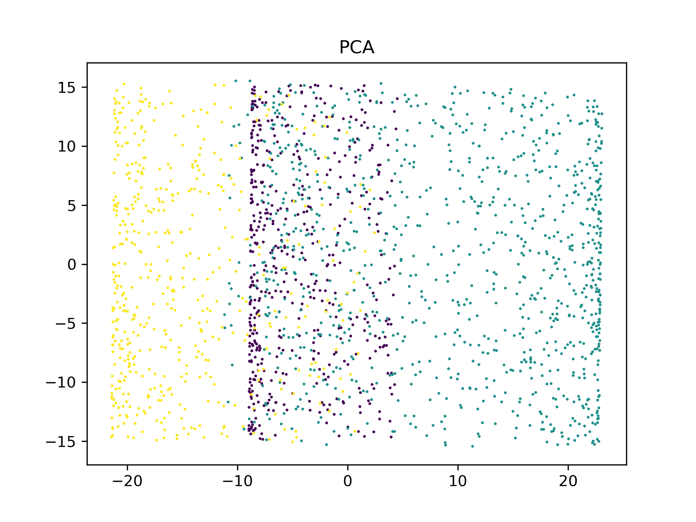
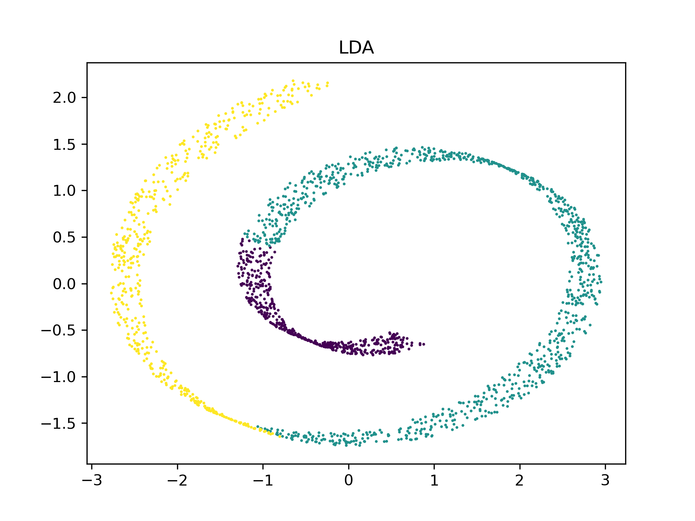
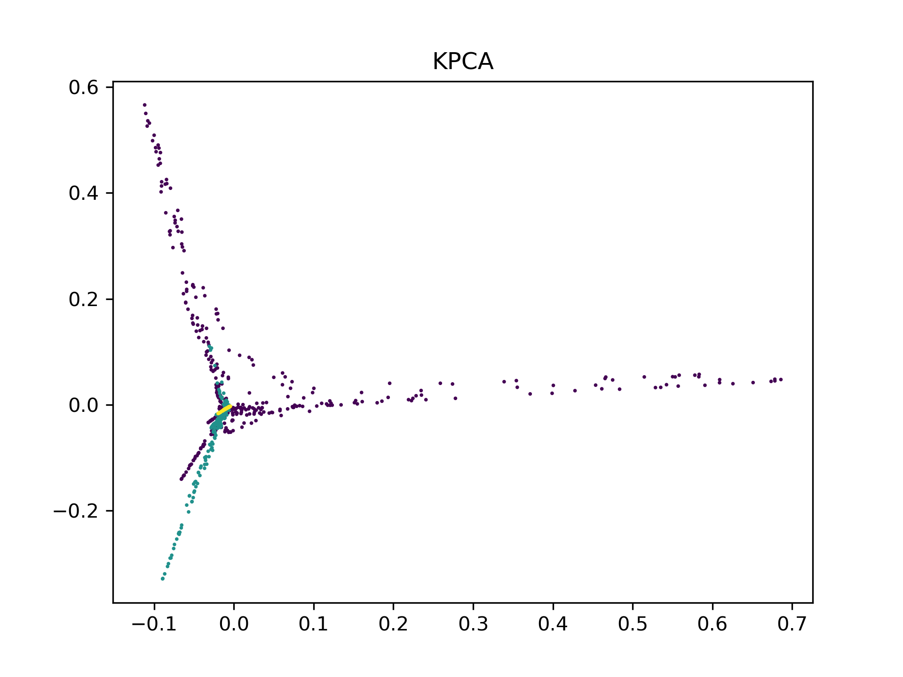
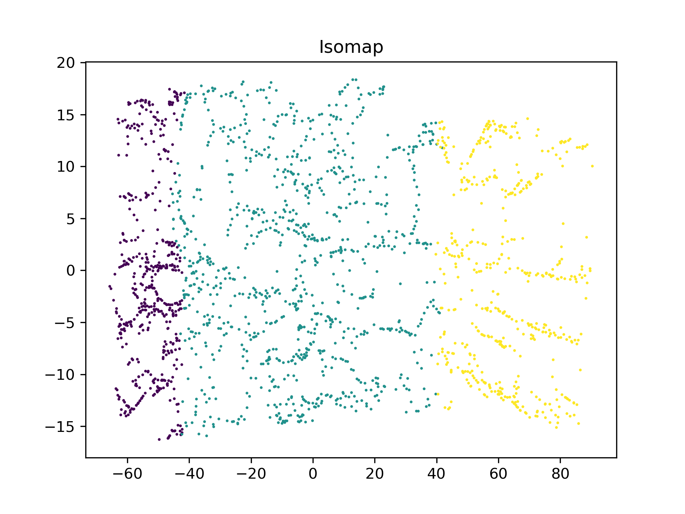
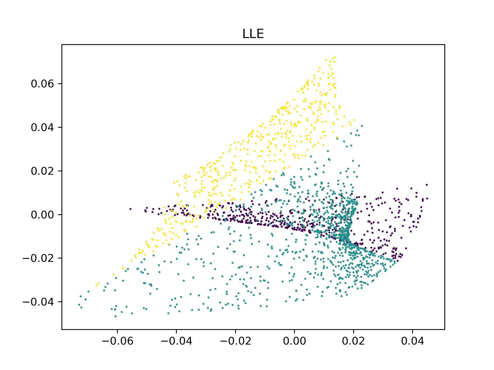
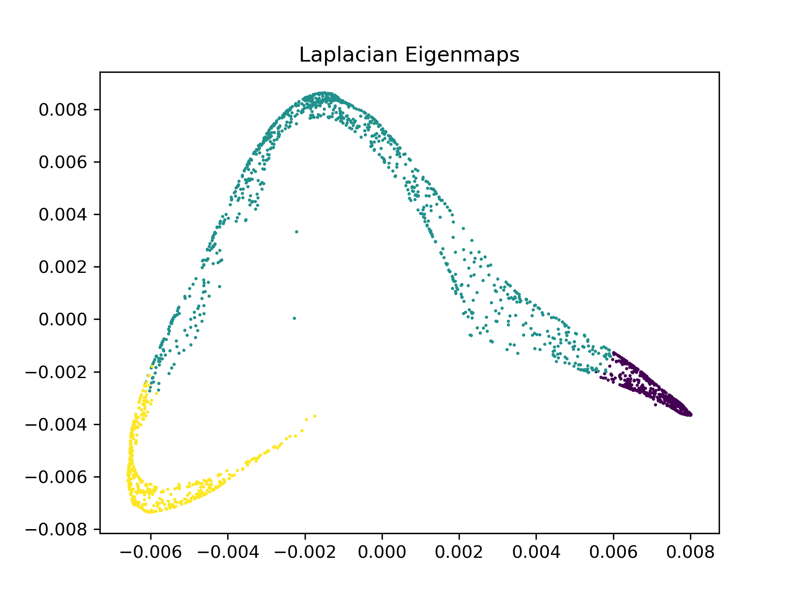

# 特征选择与变换上机题

**姓名：** 甘云冲

**学号：** 2101213081

对于给定数据，分别利用主成分分析(PCA)、线性判别分析(LDA)、 KPCA、Isomap、LLE、Laplacian Eigenmaps 投影到两维，并画出效果图，结果展示如下：

**PCA**

**LDA**

**KPCA**

**Isomap**

**LLE**

**Laplacian Eigenmaps**

